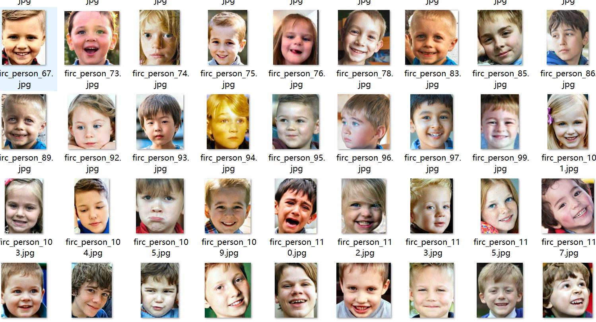
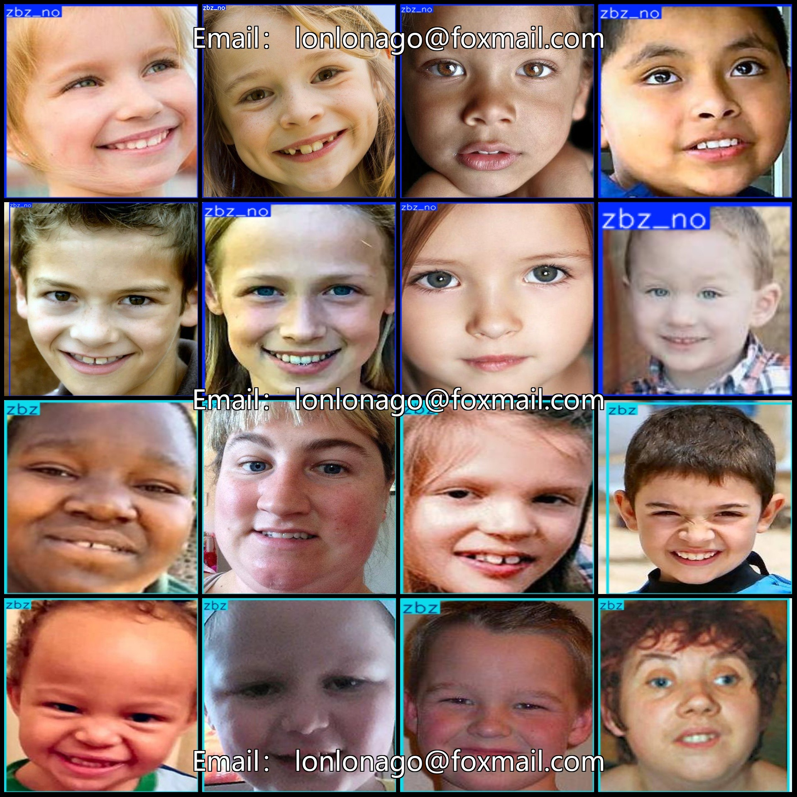
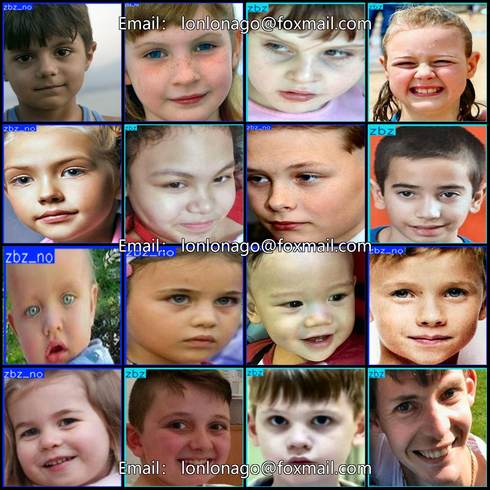

# Autism Detection Data Set for Children and Teenagers: Pascal VOC + YOLO Format (8297 Images, 2 Labels)

Dataset format: Pascal VOC format + YOLO format (without split path txt files, only containing jpg images and corresponding VOC format xml files and yolo format txt files).
Number of images (jpg file count): 8297
Number of annotations (xml file count): 8297
Number of annotations (txt file count): 8297
Number of annotation categories: 2
Annotation category names (note that the order in the yolo format is not consistent with this, but refer to the labels folder "classes.txt" for reference): ["zbz", "zbz_no"]
Boxes per category:
- zbz (autism) boxes = 3857
- zbz_no (no autism) boxes = 4440
Total boxes: 8297
Number of images per category:
- zbz (autism) images = 3857
- zbz_no (no autism) images = 4440
Image resolution: Multi-resolution images, such as 224x297, 166x159, etc.
Annotation tool used: labelImg
Annotation rules: Draw a box around the category.
Important note: The dataset does not have been divided into training, validation, and test sets; you need to do so yourself.
Special declaration: This dataset does not guarantee the accuracy of the trained models or weight files.
Image preview:
Annotation example:

## Images

Here is a pay link on Stripe ( https://buy.stripe.com/3cs8yP7sY87d0vu9AB ). Please contact me lonlonago@foxmail.com after funding $89, and I will send you a complete data files , thank you!

